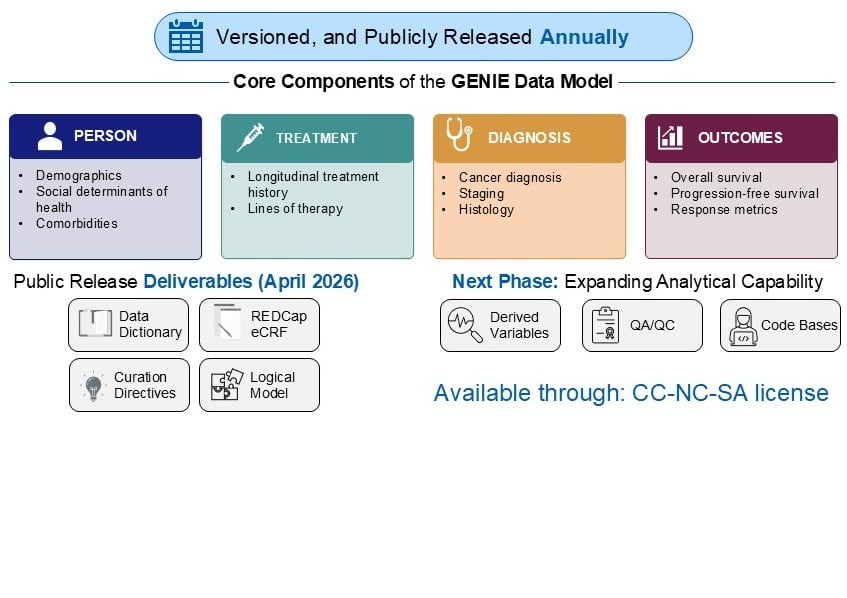

# GENIE Data Model (GDM)

The **GENIE Data Model (GDM)** is a harmonized, oncology-focused clinical data model developed by [AACR Project GENIE](https://www.aacr.org/professionals/research/aacr-project-genie/) to standardize the collection and analysis of real-world cancer data across consortium institutions worldwide.

Each annual release ships a versioned, interoperable schema that enables multi-site federated analysis without moving patient data — covering the full arc from first diagnosis through treatment and outcomes.

---

## Core Components

The GDM is organized around four clinical domains:

| Domain | What it captures |
|--------|-----------------|
| **Person** | Demographics, social determinants of health, comorbidities |
| **Treatment** | Longitudinal treatment history, lines of therapy |
| **Diagnosis** | Cancer diagnosis, staging, histology |
| **Outcomes** | Overall survival, progression-free survival, response metrics |

The public release deliverables include a **Data Dictionary**, **REDCap eCRF**, **Curation Directives**, and a **Logical Model**. Future phases will add derived variables, QA/QC tooling, and open code bases.

---

## Releases

### [GDM v1.0.1](GDM_v1.0.1/)

The first versioned public release of the GDM, targeting the breast cancer (BrCa) cohort.

| File | Description |
|------|-------------|
| [`GDM_v1.0.1_DataDictionary.csv`](GDM_v1.0.1/GDM_v1.0.1_DataDictionary.csv) | Complete field-level data dictionary — variable names, types, controlled vocabularies |
| [`GDM_v1.0.1_CurationDirectives.pdf`](GDM_v1.0.1/GDM_v1.0.1_CurationDirectives.pdf) | 259-page REDCap curation specification with source-field mappings, coding rules, and derivation logic |
| [`GDM_v1.0.1_XML.xml`](GDM_v1.0.1/GDM_v1.0.1_XML.xml) | XML logical model |
| [`SPECIFICATION.md`](GDM_v1.0.1/SPECIFICATION.md) | Human-readable table-by-table field specification with types, units, and controlled vocabularies |

#### Tables

**Core GENIE (Tier1A)** — piped directly from the GENIE genomics repository via Sage Bionetworks:

| Table | Description |
|-------|-------------|
| `clinical_patient` | Patient demographics, vital status, birth year, and contact intervals |
| `clinical_sample` | Sequenced tumor sample metadata — OncoTree code, sample type, sequencing panel ID |
| `mutations` | Somatic variant calls in MAF format (Hugo symbol, position, alleles, classification) |
| `rna_seq` | Bulk RNA expression values in TPM for 200+ genes |
| `wsi_manifest` | Whole-slide image file manifest (modality, scanner, stain, format) |

**Extended GDM (Curated)** — abstracted from EHR and tumor registry via structured REDCap curation:

| Table | Description |
|-------|-------------|
| `gdm_cancer_patient_information` | Root patient table: birth year, sex, race/ethnicity (NAACCR codes), vital status, hospice |
| `gdm_cancer_diagnosis` | ICD-O-3 site/morphology, AJCC TNM staging, metastatic sites at diagnosis, ER/PR/HER2/Oncotype (breast) |
| `gdm_clinical_visit` | Oncology visit dates, provider type, ECOG performance status, overall cancer status |
| `gdm_drug_exposure` | Longitudinal systemic therapy — NCI Thesaurus drug names, start/end dates, route, dose, discontinuation reason |
| `gdm_imaging` | Radiologic studies — modality, body site, evidence of disease, response assessment |
| `gdm_surgical_procedures` | Pathology reports — procedure type, margins, neoadjuvant flag, Ki-67, ER/PR/HER2, axillary node count |
| `gdm_biomarkers` | PD-L1 testing (TPS/CPS/IC scoring) and serum tumor markers (CA15-3, CA27-29) |
| `gdm_tumor_sample_information` | NGS sample class, collection and report dates, OncoTree code, GENIE submission flag |

> **Temporal encoding:** All date fields in curated tables use **days-from-birth** integers — preserving temporal relationships while protecting patient privacy.

---

## Entity Diagrams

The [`diagram/`](diagram/) directory contains SVG logical model diagrams for each GDM entity:

`patient` · `visit` · `visit_detail` · `condition` · `cancer_condition` · `cancer_specimen` · `specimen` · `medication` · `therapeutic_procedure` · `procedure` · `imaging` · `imaging_result` · `pathology_report` · `genomic` · `laboratory_result` · `observation` · `order` · `report` · `report_section` · `death` · `death_cause` · `cohort` · `cohort_definition` · `location` · `site` · `organization` · `provider`

---

## License

Available under a [CC BY-NC-SA](license) license. Data shared through AACR Project GENIE remains subject to the [GENIE data use agreement](https://www.aacr.org/professionals/research/aacr-project-genie/aacr-project-genie-data/).
