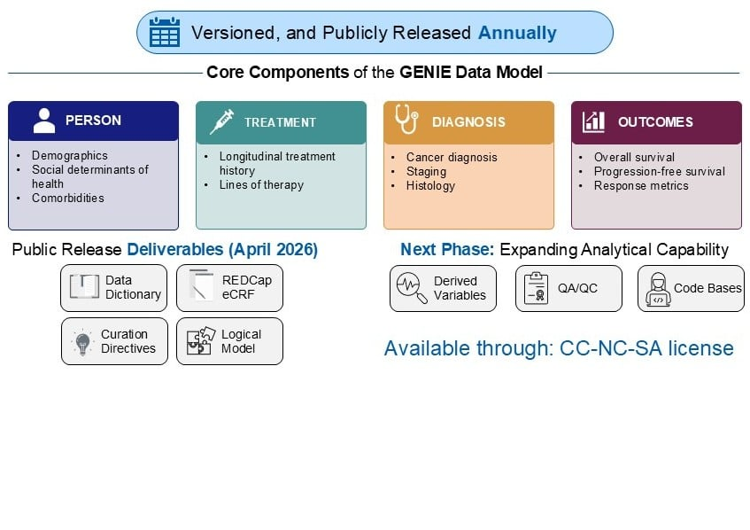

# GENIE Data Model (GDM)



The **GENIE Data Model (GDM)** is the open, versioned clinical data standard behind
[AACR Project GENIE](https://www.aacr.org/professionals/research/aacr-project-genie/).
It defines how a cancer center represents a patient's demographics, diagnoses, treatments
and outcomes so that data curated at many institutions can be pooled and analysed together.

This repository is the public home of the model. It holds the release artifacts, a
field-level reference, and an implementation guide for teams mapping their own data into GDM.

**License:** [CC BY-NC-SA 4.0](license). Free to use for non-commercial research with attribution.

---

## Start here

| If you are… | Read this first | Then |
|---|---|---|
| **A data engineer mapping your institution's data into GDM** | [Implementation Guide](docs/implementation-guide.md) | [Complete Data Dictionary](GDM_v1.0.1/DATA_DICTIONARY.md), [worked example](etl-plan.html) |
| **A clinical data curator abstracting charts** | [Curation Directives (PDF)](GDM_v1.0.1/GDM_v1.0.1_CurationDirectives.pdf) | [Complete Data Dictionary](GDM_v1.0.1/DATA_DICTIONARY.md) for branching logic and codes |
| **An analyst working with GDM-shaped data** | [Field Specification](GDM_v1.0.1/SPECIFICATION.md) | [Logical model diagrams](diagram/) |
| **Building tooling against the schema** | [`GDM_v1.0.1_DataDictionary.csv`](GDM_v1.0.1/GDM_v1.0.1_DataDictionary.csv) (REDCap export) | [`GDM_v1.0.1_XML.xml`](GDM_v1.0.1/GDM_v1.0.1_XML.xml) (CDISC ODM), [`scripts/`](scripts/) |

---

## The model in two minutes

**Two layers, one patient key.**

1. **Core GENIE (Tier1A).** The genomic and minimal clinical data every GENIE center already
   submits: patient, sample, and mutation files that Sage Bionetworks standardises and
   publishes on [Synapse](https://www.synapse.org/) and [cBioPortal](https://www.cbioportal.org/genie/).
   GDM does not redefine these; it *references* them. Tier1A values appear in GDM as
   read-only "piped in" fields.
2. **Extended GDM (curated).** Fourteen tables of clinical detail abstracted from the
   EHR and tumor registry using a REDCap instrument. This is what the GDM release defines.

Every extended table joins to the patient root on `patient_id_curated`, which is the GENIE
patient identifier (`GENIE-<CENTER>-<ID>`).

**The fourteen tables.**

| Table | One row per… | Fields |
|---|---|---:|
| `cancer_patient_information` | patient (root table) | 64 |
| `family_history` | patient | 2 |
| `comorbidities` | patient | 27 |
| `cancer_diagnosis` | cancer diagnosis | 92 |
| `imaging` | radiology report | 72 |
| `clinical_visits` | oncology visit | 42 |
| `surgical_procedures` | pathology report (incl. biomarkers) | 202 |
| `drug_exposure` | drug exposure | 37 |
| `clinical_trial_history` | trial enrollment | 16 |
| `radiation_treatment` | radiation course | 29 |
| `tumor_sample_information` | sequenced sample | 42 |
| `hospitalizations` | hospitalization | 21 |
| `laboratory_testing` | lab result | 10 |
| `patient_curation_eligibility` | patient (curation workflow only) | 7 |

**Conventions you will meet everywhere.**

- **No calendar dates leave the site.** Every date is stored as an integer number of days
  since the patient's date of birth, in a field ending in `_int`. Intervals between events
  are preserved exactly; re-identifiable dates are not.
- **Coded values.** Categorical fields store a code (`1`, `2`, `99`…) whose meaning is fixed by
  the data dictionary. Codes follow NAACCR, AJCC, ICD-O-3, OncoTree, NCI Thesaurus and LOINC
  where a standard exists.
- **Checkboxes** become one 0/1 column per option (`field___1`, `field___2`, …).
- **Branching logic** (the "shown when" condition on a field) is also its nullability rule.
- **Suffixes carry meaning:** `_int` days from birth, `_curated` abstracted by a curator,
  `_tr` / `_trhis` piped from the tumor registry, `_other` free-text for "Other", `qa_` curation
  workflow.

The [Implementation Guide](docs/implementation-guide.md) walks through each of these with
examples.

---

## Releases

New versions are released annually. Each release directory contains the same four artifacts
plus generated documentation.

### [GDM v1.0.1](GDM_v1.0.1/) — current

| File | What it is | Use it for |
|---|---|---|
| [`DATA_DICTIONARY.md`](GDM_v1.0.1/DATA_DICTIONARY.md) | Every field in every table, with types, allowed values, branching logic and flags. Generated from the CSV. | Field-by-field mapping and validation |
| [`SPECIFICATION.md`](GDM_v1.0.1/SPECIFICATION.md) | Prose specification of the principal tables, with the rationale behind key conventions. | Orientation and analyst reference |
| [`GDM_v1.0.1_DataDictionary.csv`](GDM_v1.0.1/GDM_v1.0.1_DataDictionary.csv) | REDCap data dictionary export. The authoritative schema. | Machine-readable schema; import into REDCap |
| [`GDM_v1.0.1_XML.xml`](GDM_v1.0.1/GDM_v1.0.1_XML.xml) | CDISC ODM 1.3.1 export of the REDCap project (metadata only). | Tooling that speaks ODM; instrument repeat configuration |
| [`GDM_v1.0.1_CurationDirectives.pdf`](GDM_v1.0.1/GDM_v1.0.1_CurationDirectives.pdf) | 259-page curation manual: definition, source documents and coding rules for each variable. | Curator training; resolving ambiguous mappings |

See the [release README](GDM_v1.0.1/README.md) for details and known gaps.

---

## Implementing GDM at your institution

The short version of the [Implementation Guide](docs/implementation-guide.md):

1. **Inventory your sources.** Tumor registry (NAACCR), EHR problem list and notes, pathology,
   pharmacy or infusion records, radiology, NGS reports, trial management system.
2. **Build the patient spine.** One row per patient in `cancer_patient_information`, keyed on
   the GENIE patient ID, with date of birth held back for date arithmetic.
3. **Convert every date to days from birth** and drop the calendar date.
4. **Map tables in dependency order:** patient root first, then per-event tables, then tables
   that depend on samples or diagnoses.
5. **Map vocabularies** to the GDM code lists. Watch for fields where REDCap stores a list
   index rather than the standard code.
6. **Apply branching logic as null rules**, exclude PHI and `qa_` fields, and run the
   validation checklist.

A complete worked example, mapping the public GENIE BPC breast cancer release into GDM
field by field, is in the [case study](etl-plan.html). It was produced by one implementer
on one platform and is offered as illustration, not as the reference implementation.

---

## Logical model diagrams

The [`diagram/`](diagram/) directory holds SVG entity diagrams of the **GENIE Logical Model**,
a conceptual view of the domain (patient, visit, condition, medication, specimen, report,
genomic result and so on) that the REDCap instrument implements. Start with
[`diagram/index.svg`](diagram/index.svg) and see [`diagram/README.md`](diagram/README.md) for
how the logical entities relate to the fourteen physical tables.

---

## Versioning, feedback and contributions

- Releases are tagged `GDM_v<major>.<minor>.<patch>` and live in a directory of the same name.
  Field names and codes are stable within a major version.
- Found an inconsistency between the dictionary, the PDF and the specification? Open an issue
  on the [AACR-Project-GENIE/GENIE-data-model](https://github.com/AACR-Project-GENIE/GENIE-data-model)
  repository.
- Regenerate the Markdown data dictionary after any change to the CSV:

  ```bash
  python3 scripts/build_data_dictionary.py GDM_v1.0.1/GDM_v1.0.1_DataDictionary.csv GDM_v1.0.1/GDM_v1.0.1_XML.xml GDM_v1.0.1/DATA_DICTIONARY.md
  ```

---

## License and data access

The data model is released under [CC BY-NC-SA 4.0](license). Patient data distributed
through AACR Project GENIE is governed separately by the
[GENIE Data Use Agreement](https://www.aacr.org/professionals/research/aacr-project-genie/aacr-project-genie-data/)
and is obtained from [Synapse](https://www.synapse.org/), not from this repository.
